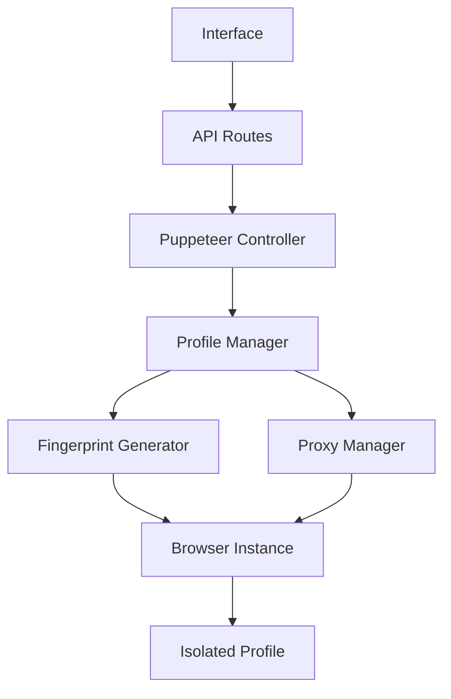

# 🔐 OpenMultiLogin: Secure Multi-Login System

<div align="center">


**Sistema avançado de multi-login com isolamento completo de perfis e fingerprinting inteligente**

[Funcionalidades](#-funcionalidades) • [Instalação](#-instalação) • [Uso](#-uso) • [Arquitetura](#-arquitetura) • [Segurança](#-segurança)

</div>

---

## 📋 Visão Geral

O **OpenMultiLogin** é uma solução profissional para gerenciamento de múltiplas identidades digitais, oferecendo isolamento completo de perfis, fingerprinting avançado e proxy management. Ideal para profissionais que precisam gerenciar múltiplas contas com máxima segurança e privacidade.

### 🎯 Principais Benefícios

- **🔒 Isolamento Total**: Cada perfil possui cookies, cache e dados completamente separados
- **🎭 Fingerprinting Inteligente**: Geração automática de impressões digitais únicas e consistentes
- **🌐 Proxy Management**: Sistema robusto de gerenciamento e teste de proxies
- **🛡️ Anti-Detecção**: Plugin Stealth integrado para evitar detecção de automação
- **📊 Monitoramento**: Dashboard em tempo real com métricas de saúde dos perfis

---

## ✨ Funcionalidades

### 🏠 Dashboard Inteligente
- **Visão Geral**: Snapshot de perfis ativos, saúde dos proxies e atividade recente
- **Métricas em Tempo Real**: Gráficos e indicadores de performance
- **Alertas de Segurança**: Notificações sobre inconsistências ou problemas

### 👤 Gerenciamento de Perfis
- **Criação Avançada**: Perfis com fingerprints únicos para Windows/macOS/Linux
- **Configuração Detalhada**: User Agent, resolução, timezone, idioma, hardware
- **Lançamento Isolado**: Instâncias Chromium completamente separadas
- **Organização**: Sistema de tags e categorização

### 🌐 Sistema de Proxy
- **Gerenciamento Centralizado**: Base de dados de proxies com teste automático
- **Suporte Múltiplos Tipos**: HTTP, HTTPS, SOCKS4, SOCKS5
- **Validação em Tempo Real**: Teste de conectividade e latência
- **Rotação Inteligente**: Distribuição automática entre perfis

### 🔍 Teste de Fingerprint
- **Detecção Atual**: Análise da impressão digital do navegador
- **Validação**: Verificação de consistência e qualidade
- **Sites de Teste**: Integração com whatismybrowser.com e similares
- **Score de Qualidade**: Métrica de confiabilidade da impressão digital

### ⚙️ Configurações Avançadas
- **Personalização**: Temas, cores e preferências de interface
- **Backup/Restore**: Sistema de backup completo dos dados
- **Logs Detalhados**: Sistema de logging para debugging e auditoria

---

## 🚀 Instalação

### Pré-requisitos

- **Node.js** 18.0 ou superior
- **npm** ou **yarn**
- **Windows** (otimizado para CMD)

### Instalação Rápida

```bash
# Clone o repositório
git clone https://github.com/thiagovelsa/SysMultiLogin.git
cd SysMultiLogin

# Instale as dependências
npm install

# Configure as variáveis de ambiente
copy .env.example .env

# Inicie o servidor de desenvolvimento
npm run dev
```

### Configuração de Ambiente

Crie um arquivo `.env.local` na raiz do projeto:

```env
# Configurações da aplicação
NEXT_PUBLIC_APP_NAME=OpenMultiLogin
NEXT_PUBLIC_APP_VERSION=0.1.0

# Configurações de proxy (opcional)
DEFAULT_PROXY_TIMEOUT=10000
MAX_CONCURRENT_PROFILES=10

# Configurações de segurança
ENABLE_STEALTH_MODE=true
FINGERPRINT_CACHE_TTL=3600
```

---

## 💻 Uso

### Iniciando a Aplicação

```bash
# Desenvolvimento
npm run dev

# Build para produção
npm run build
npm start

# Verificação de tipos
npm run typecheck

# Linting
npm run lint
```

### Criando seu Primeiro Perfil

1. **Acesse o Dashboard**: `http://localhost:9002`
2. **Navegue para Perfis**: Clique em "Perfis" na sidebar
3. **Criar Novo Perfil**:
   - Nome: `Perfil Teste`
   - OS: `Windows`
   - Navegador: `Chrome`
   - Proxy: Selecione um proxy configurado
4. **Gerar Fingerprint**: Clique em "Gerar Automaticamente"
5. **Salvar e Lançar**: Salve o perfil e clique em "Iniciar"

### Gerenciando Proxies

1. **Acesse Proxies**: Navegue para a seção "Proxies"
2. **Adicionar Proxy**:
   ```
   Tipo: HTTP
   Host: 192.168.1.100
   Porta: 8080
   Usuário: username (opcional)
   Senha: password (opcional)
   ```
3. **Testar Conexão**: Use o botão "Testar" para validar
4. **Associar a Perfis**: Selecione o proxy ao criar perfis

---

## 🏗️ Arquitetura

### Estrutura do Projeto

```
src/
├── app/                    # Next.js App Router
│   ├── (main)/            # Layout principal
│   │   ├── dashboard/     # Dashboard principal
│   │   ├── profiles/      # Gerenciamento de perfis
│   │   ├── proxies/       # Gerenciamento de proxies
│   │   └── fingerprint-test/ # Teste de fingerprints
│   └── api/               # API Routes
│       ├── generate-fingerprint/ # Geração de fingerprints
│       ├── launch/        # Lançamento de perfis
│       └── test-proxy/    # Teste de proxies
├── components/            # Componentes React
│   ├── ui/               # Componentes base (shadcn/ui)
│   ├── profiles/         # Componentes de perfis
│   ├── proxies/          # Componentes de proxies
│   └── layout/           # Componentes de layout
├── lib/                  # Utilitários e tipos
├── hooks/                # Custom hooks
└── server/               # Lógica do servidor
```

### Tecnologias Utilizadas

- **Frontend**: Next.js 15, React 18, TypeScript
- **UI**: Tailwind CSS, shadcn/ui, Radix UI
- **Automação**: Puppeteer, Puppeteer Extra
- **Anti-Detecção**: Puppeteer Stealth Plugin
- **Validação**: Zod, React Hook Form
- **Animações**: Framer Motion
- **Ícones**: Lucide React

### Fluxo de Dados



---

## 🔒 Segurança

### Isolamento de Perfis

- **Diretórios Únicos**: Cada perfil usa `./chromium-profiles/[profile-id]/`
- **Dados Separados**: Cookies, LocalStorage, cache, sessões isolados
- **Memória Independente**: Processos completamente separados

### Fingerprinting Avançado

- **User Agent Realista**: Baseado em estatísticas reais de uso
- **Hardware Consistente**: CPU, GPU, memória coerentes com o OS
- **Geolocalização**: Timezone e idioma consistentes
- **WebGL/Canvas**: Fingerprints únicos mas realistas

### Anti-Detecção

- **Stealth Plugin**: Remove sinais de automação
- **Comportamento Humano**: Delays e movimentos naturais
- **Headers Realistas**: Headers HTTP consistentes
- **JavaScript Masking**: Ocultação de propriedades de automação

### Proxy Security

- **Validação Rigorosa**: Teste de conectividade e anonimato
- **Rotação Inteligente**: Evita padrões detectáveis
- **Timeout Management**: Prevenção de vazamentos de IP
- **Logs Seguros**: Não armazena credenciais em logs

---

## 📊 Monitoramento e Logs

### Sistema de Logs

```typescript
// Exemplo de log estruturado
logger.info('Profile launched successfully', {
  profileId: 'prof_123',
  fingerprint: 'fp_456',
  proxy: 'proxy_789',
  timestamp: new Date(),
  userAgent: 'Mozilla/5.0...'
});
```

### Métricas Disponíveis

- **Performance**: Tempo de inicialização, uso de memória
- **Segurança**: Tentativas de detecção, falhas de proxy
- **Uso**: Perfis ativos, sessões por dia, tempo de uso
- **Qualidade**: Score de fingerprint, consistência de dados

---

## 🛠️ Desenvolvimento

### Scripts Disponíveis

```bash
npm run dev          # Servidor de desenvolvimento
npm run build        # Build para produção
npm run start        # Servidor de produção
npm run lint         # Verificação de código
npm run typecheck    # Verificação de tipos TypeScript
```

### Estrutura de Commits

```
feat: adiciona nova funcionalidade
fix: corrige bug específico
docs: atualiza documentação
style: mudanças de formatação
refactor: refatoração de código
test: adiciona ou modifica testes
chore: tarefas de manutenção
```

### Contribuindo

1. Fork o projeto
2. Crie uma branch para sua feature (`git checkout -b feature/nova-funcionalidade`)
3. Commit suas mudanças (`git commit -m 'feat: adiciona nova funcionalidade'`)
4. Push para a branch (`git push origin feature/nova-funcionalidade`)
5. Abra um Pull Request

---

## 📝 Changelog

### v0.1.0 (Atual)
- ✅ Sistema básico de multi-login
- ✅ Gerenciamento de perfis e proxies
- ✅ Geração automática de fingerprints
- ✅ Dashboard com métricas
- ✅ Plugin Stealth integrado
- ✅ Teste de fingerprints

### Próximas Versões
- 🔄 Sistema de backup automático
- 🔄 API para integração externa
- 🔄 Suporte a extensões do Chrome
- 🔄 Análise comportamental avançada
- 🔄 Relatórios de segurança

---

## 🆘 Suporte

### Problemas Comuns

**Erro de inicialização do Puppeteer**
```bash
# Limpe o cache e reinstale
npm cache clean --force
del /S /Q node_modules
del package-lock.json
npm install
```

**Proxy não conecta**
- Verifique as credenciais
- Teste a conectividade manualmente
- Verifique firewall/antivírus

**Fingerprint inconsistente**
- Regenere o fingerprint
- Verifique compatibilidade OS/Browser
- Valide no teste de fingerprint

### Contato

- **Issues**: [GitHub Issues](https://github.com/thiagovelsa/SysMultiLogin/issues)
- **Documentação**: [Wiki do Projeto](https://github.com/thiagovelsa/SysMultiLogin/wiki)
- **Email**: thiagovelsa@gmail.com

---

## 📄 Licença

Este projeto está licenciado sob a Licença MIT - veja o arquivo [LICENSE](LICENSE) para detalhes.

**© 2024 OpenMultiLogin. Código aberto para a comunidade.**

---

<div align="center">

**Desenvolvido com ❤️ para máxima segurança e privacidade**

[⬆️ Voltar ao topo](#-openmultilogin-secure-multi-login-system)

</div>
